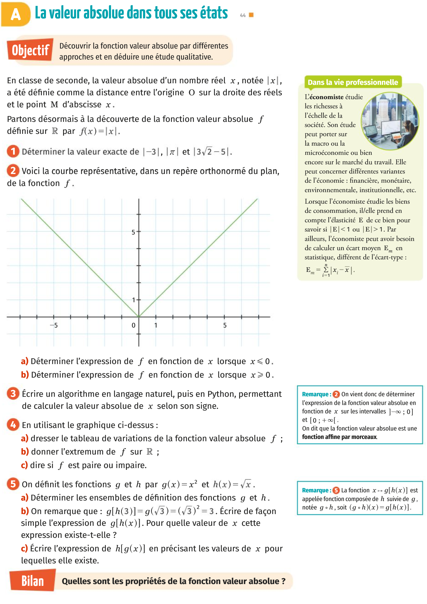



### Devoirs 
Pour mardi 10 septembre 2019: **Exercices 1 à 8 page 14** 

0. Rituel: 
* Développer et réduire l'expression $3x^2-5(2x+1)^2$.
* Factoriser $25x^2+20x+4$, résoudre l'équation $25x^2+20x+4=0$.

1. Activité A page 44. 

