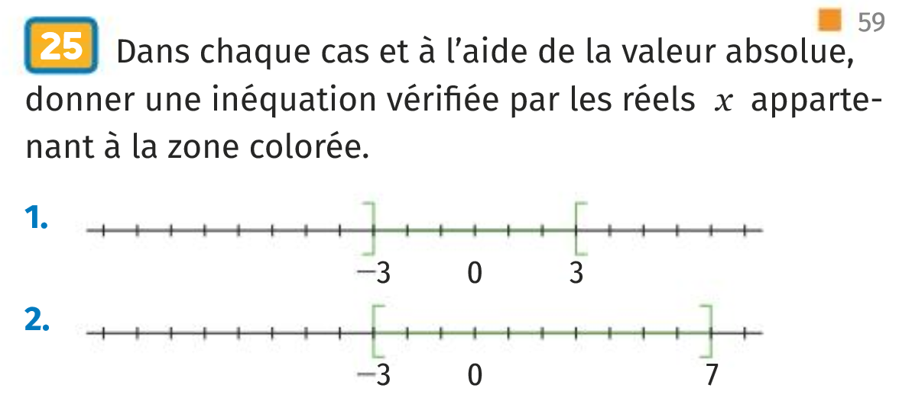
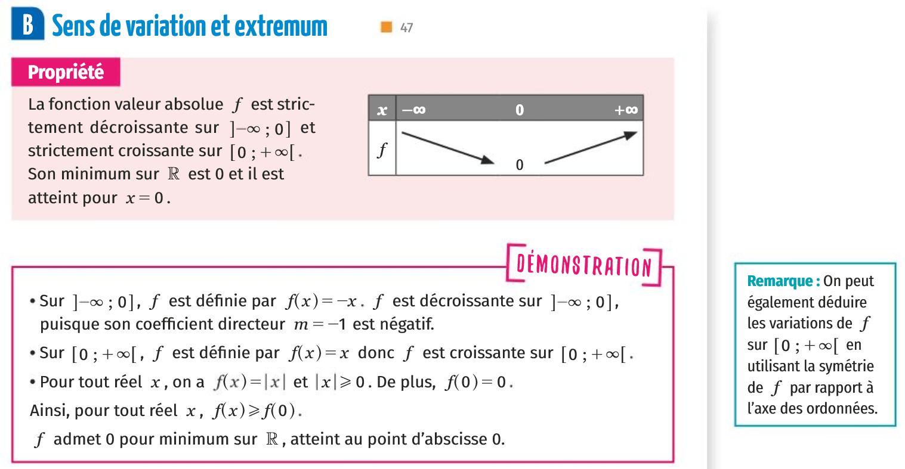
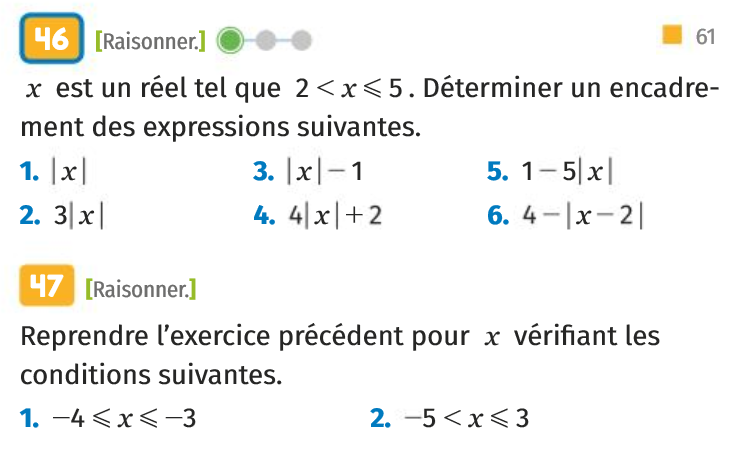



### Devoirs

Pour mardi 17 septembre 2019: 

* Relire le cours partie **1A page 46**. 
* Faire les exercices **21 et 25 page 59**.  
* Relire le cours partie **1B page 47**. 
* Faire les exercices **46 et 47 page 61**. 
* Recopier et apprendre les deux définitions et propriétés du cours page 48 et 49 du [livre numérique](https://fr.calameo.com/read/000596729923535cd3427).

0. Rituel: 
  * Résoudre l'équation $-3x+2=0 $.
  * Résoudre l'inéquation $-3x+2 < 0$.

1. Résoudre graphiquement puis algébriquement (par le calcul) l'équation $|x|=3$.

1. En utilisant le tableau de variations de la valeur absolue, résoudre l'équation et les inéquations suivantes:
$|x|<3; |x|>3$.

1. On considère une réel $x$ tel que $2 \leq x <5$. Déterminer le meilleur encadrement possible pour $2-3|x|$.

1. On considère une réel $x$ tel que $-2 \leq x <1$. Déterminer le meilleur encadrement possible pour $5|x|-3$.

1. Montrer que pour tout entier naturel $n$, si n est impair alors $n^2$ est impair. Montrer la réciproque de cette propriété.

2. Sachant que la fonction $f:[0;10]$ dans $\mathbb{R}$, $f(x)=2x+1$ est strictement croissante:
  - Comparer $f(1)$ et $f(3)$.
  - Si $x_1 < x_2$ sont des éléments de $[0;10]$, comparer $f(x_1)$ et $f(x_2)$.

3. Proposer une définition formelle de la notion de fonction strictement croissante.

5. Montrer que la fonction $f(x)=2x+1$ est strictement croissante.

6. Démontrer les variations de la fonction valeur absolue.

6. Démontrer que la fonction carrée est strictement décroissante sur l'intervalle des rééls négatifs.

4. Simplifier la négation de la proposition formelle de la stricte décroissance pour une fonction f sur un ensemble E.

7. Montrer que la fonction inverse n'est pas décroissante sur son ensemble de définition.

15. Montrer que la fonction inverse est décroissante sur $]-\infty, 0[$

1. À 14 heures à lorgues, il faisait $t_1=28.2°C$ et à 21h $t_2=25.3°C$. Quel est l'écart entre ces deux mesures et quel est l'écart absolu ? Présenter une expression formelle en $t_1$,$t_2$ pour ces deux quantités.

1. On considère les points $A_1(2;0)$ et $A_2(\pi;0)$, dans un repère orthonormé. 
  * Calculer la distance $A_1A_2$ en rappelant la formule générale (on note $A_1(x_1;y_1)$ et $A_2(x_2;y_2))$.
  * Calculer les coordonnées du vecteur $\vec{A_1A_2}$ en rappelant la formule générale.

10. Rappeler la définition d'une fonction impaire.

11. Montrer que la fonction $h(x)=1+x^3$ n'est pas impaire.

12. Rappeler la définition du nombre racine carrée de 2.

13. Proposer un énoncé mathématique qui exprime le bien fondé de la définition précédente.

14. Démontrer l'unicité dans la définition de la racine 2.

16. Montrer que la fonction racine carrée est croissante sur son ensemble de définition.

