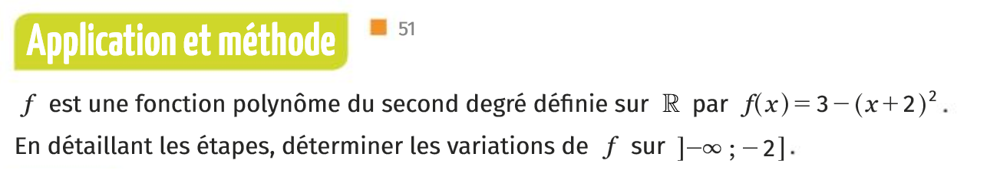
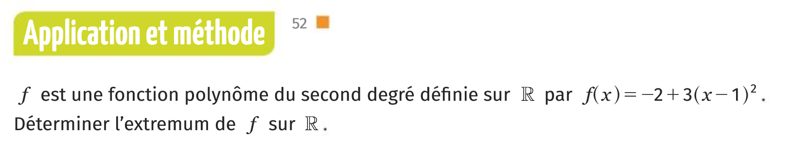
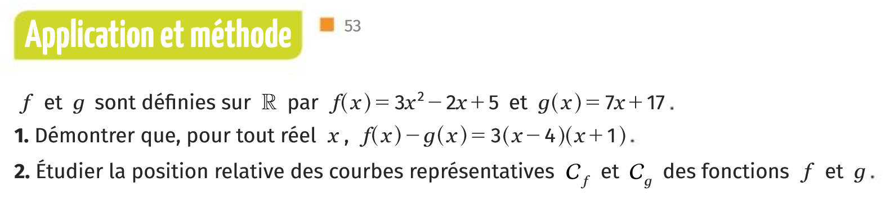



### Devoirs

Pour jeudi 19 septembre 2019: 

*  Relire les deux définitions et propriétés du cours page 48 et 49 du [livre numérique](https://fr.calameo.com/read/000596729923535cd3427).

* Montrer que la fonction $f$ définie par $f(x)= \frac{1}{1+x^2}$ est bien définie est strictement décroissante sur l'intervalle $[1;+\infty[$.

### Plan de séance

0. Rituel: Reconnaître pour chacun des trinômes quelle est la forme proposée:
* $5(x-2)(x-3)$ 
* $2x^2+4x+7$ 
* $6(x-4)^2+2$

6. Démontrer que la fonction carrée est strictement décroissante sur l'intervalle des rééls négatifs.

6. Démontrer les variations de la fonction valeur absolue.

4. Simplifier la négation de la proposition formelle de la stricte décroissance pour une fonction f sur un ensemble E.

7. Montrer que la fonction inverse n'est pas décroissante sur son ensemble de définition.

15. Montrer que la fonction inverse est décroissante sur $]-\infty, 0[$.

1. Exercice méthode 

1. Exercice méthode 

1. Exercice méthode 

1. Exercice méthode 

1. Exercice méthode 

1. Soient $a,b,c$ trois réels avec $a \neq 0$. Notons $\Delta=b^2-4ac$. 
 * Développer, réduire $a[x-(-\frac{b}{2a})^2]-\frac{\Delta}{4a}$.

<!--
10. Rappeler la définition d'une fonction impaire.

11. Montrer que la fonction $h(x)=1+x^3$ n'est pas impaire.

12. Rappeler la définition du nombre racine carrée de 2.

13. Proposer un énoncé mathématique qui exprime le bien fondé de la définition précédente.

14. Démontrer l'unicité dans la définition de la racine 2.

16. Montrer que la fonction racine carrée est strictement croissante sur son ensemble de définition.

1. À 14 heures à lorgues, il faisait $t_1=28.2°C$ et à 21h $t_2=25.3°C$. Quel est l'écart entre ces deux mesures et quel est l'écart absolu ? Présenter une expression formelle en $t_1$,$t_2$ pour ces deux quantités.

1. On considère les points $A_1(2;0)$ et $A_2(\pi;0)$, dans un repère orthonormé. 
  * Calculer la distance $A_1A_2$ en rappelant la formule générale (on note $A_1(x_1;y_1)$ et $A_2(x_2;y_2))$.
  * Calculer les coordonnées du vecteur $\vec{A_1A_2}$ en rappelant la formule générale.
-->
