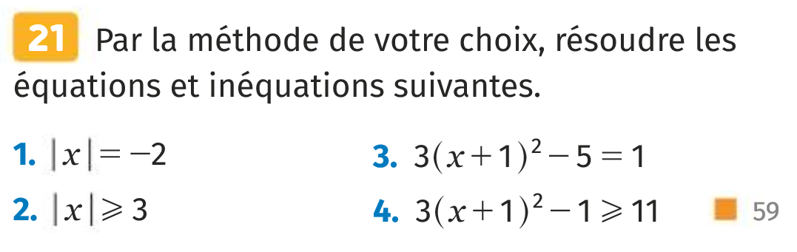



### Devoirs

Pour jeudi 19 septembre 2019: 

*  Relire les deux définitions et propriétés du cours page 48 et 49 du [livre numérique](https://fr.calameo.com/read/000596729923535cd3427).

* Montrer que la fonction $f$ définie par $f(x)= \frac{1}{1+x^2}$ est bien définie est strictement décroissante sur l'intervalle $[1;+\infty[$.

### Plan de séance

0. Rituel: Reconnaître pour chacun des trinômes quelle est la forme proposée:
* $5(x-2)(x-3)$ 
* $2x^2+4x+7$ 
* $6(x-4)^2+2$

6. Démontrer que la fonction carrée est strictement décroissante sur l'intervalle des rééls négatifs.

6. Démontrer que la fonction carrée est strictement croissante sur l'intervalle des rééls positifs.

1. Corrections des exercices
* **21 et 25 page 59**.  

* **46 et 47 page 61**. 

