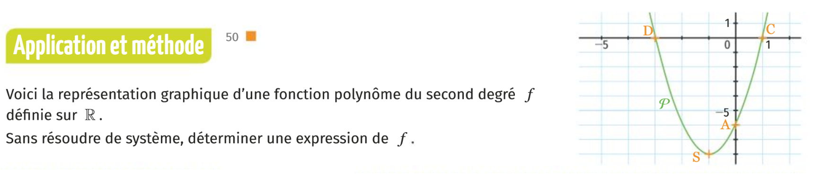
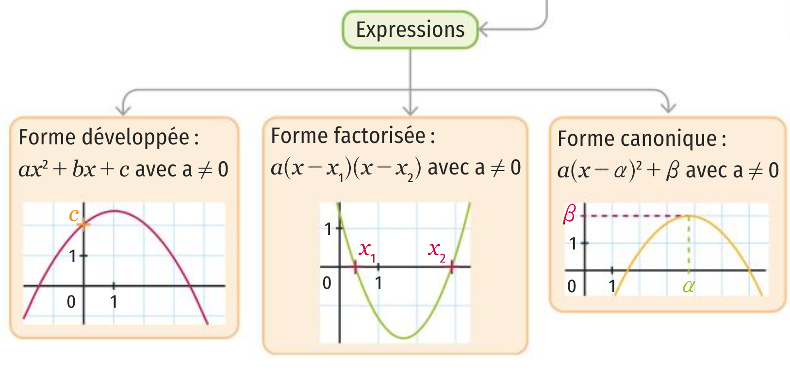
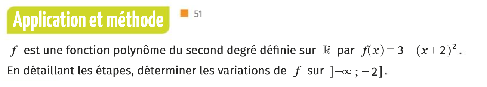
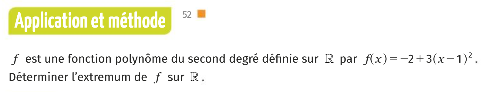
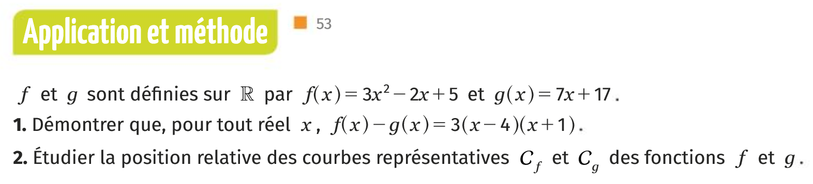



### Devoirs

Pour mardi 3 octobre 2019: Contrôle de mathématiques.

### Plan de séance

1. Rituel résoudre 
  * $\|5x+1\|=2$.
  * $\|2x-1\| < 4$.

1. Exercice méthode page 50 Indication: 

1. Exercice méthode page 51

<!--

1. Exercice méthode page 52

1. Exercice méthode page 53 

12. Rappeler la définition du nombre racine carrée de 2.

13. Proposer un énoncé mathématique qui exprime le bien fondé de la définition précédente.

14. Démontrer l'unicité dans la définition de la racine 2.

1. Démontrer que pour tout entier naturel n, si n est pair alors $n^2$ est pair.

10. Rappeler la définition d'une fonction impaire.

11. Montrer que la fonction $h(x)=1+x^3$ n'est pas impaire.

1. Soient $a,b,c$ trois réels avec $a \neq 0$. Notons $\Delta=b^2-4ac$. 
 * Développer, réduire $a[x-(-\frac{b}{2a})]^2-\frac{\Delta}{4a}$.
 * Développer, réduire $a(x-x_1)(x-x_2)$.
 * Développer, réduire $a(x-\frac{-b-\sqrt{\Delta}}{2a})(x-\frac{-b+\sqrt{\Delta}}{2a})$ (On a supposé $\Delta \geq 0$).

1. À 14 heures à lorgues, il faisait $t_1=28.2°C$ et à 21h $t_2=25.3°C$. Quel est l'écart entre ces deux mesures et quel est l'écart absolu ? Présenter une expression formelle en $t_1$,$t_2$ pour ces deux quantités.

1. On considère les points $A_1(2;0)$ et $A_2(\pi;0)$, dans un repère orthonormé. 
  * Calculer la distance $A_1A_2$ en rappelant la formule générale (on note $A_1(x_1;y_1)$ et $A_2(x_2;y_2))$.
  * Calculer les coordonnées du vecteur $\vec{A_1A_2}$ en rappelant la formule générale.
-->
