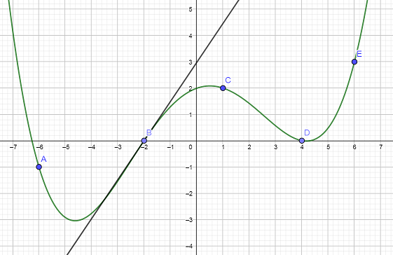



# QCM

A. Soient $\vec{u}$ et $\vec{v}$ deux vecteurs orthogonaux tels que $||\vec{u}||=3$ et $||\vec{v}||=5$. 

$(2\vec{u}+\vec{v})(\vec{u}-3\vec{v})$ est égal à 

1. $84$
2. $-57$
3. $-132$
4. $198$

B. Soit $ABC$ un triangle isocèle en A et I le pied de la hauteur issue de A tel que BC=1. Alors $\vec{AB}.\vec{IB}$ est égal à :

1. $\frac{1}{2}$
2. $0$
3. $-\frac{1}{4}$
4. $-1$

C. Soit ABC un triangle tel que AB=7, AC=4 et $\widehat{BAC}=\frac{\pi}{6}$

1. $14\sqrt{3}$
2. $14\sqrt{2}$
3. $\frac{14}{3}$
4. $14$

D. On se place dans un repère orthonormé du plan. Sur la figure ci-dessous, on a tracé la courbe représentative notée $\mathcal{C}$ d’une fonction $f$ définie sur ℝ $\mathbb{R}$.

La droite passant par le point $B$ est tangente à la courbe $\mathcal{C}$ au point $B(-2;0)$.

 

1. 50005000
2. 49899999
3. 49990000 
4. 50004997

E. $(u_n)$ est la suite arithmétique telle que $u_4=4$ et $u_{10}=19$. On peut affirmer que:
1. $u_0=8$
2. $u_7=21.5$
3. $u_{12}=24$
4. $u_{14}=-27$

